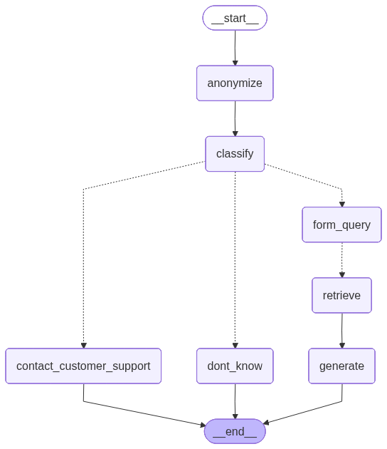

# Chatbot Backend

## 📌 Overview
- Part of my master thesis project  
- Chatbot backend logic built on RAG technology  
- Evaluated for performance on test datasets  
- First entry point for customer questions in the recycling industry  
- Answers with internal knowledge or terminates early when appropriate  
- Modular structure with production-ready logging  

## ⚙️ Features
- Anonymization of user input  
- Reformulation of user questions  
- Classification against correct internal documents  
- Early termination for irrelevant questions, small talk, or complex customer support queries  
- Adding context to questions from a vector store  
- Answering one question at a time  
- Merging multiple questions into one concise answer  
- Providing the user with a single, clear response  



## 📂 Repository Structure
- `csv/` → input CSV files that are embedded and saved in the vector store  
- `docker/` → infrastructure with Docker Compose (vector store and database)  
- `evaluation/` → test sets and results  
- `modules/` → chatbot implementation (LangGraph nodes, pipelines, etc.)  
- `notebooks/` → generate graph visualizations of the RAG pipeline  
- `utils/` → utilities (logging, config, helpers)  

## 🚀 Getting Started

### Prerequisites
- Python 3.13  
- Docker + Docker Compose  
- Other dependencies (see `/requirements.txt`)  

### Installation
```bash
# clone repo
git clone https://github.com/maxih4/masterarbeit
cd masterarbeit/chatbot/

# install dependencies
pip install -r requirements.txt

# install spacy model for anonymization
python -m spacy download de_core_news_lg

# run docker compose
cd docker
docker compose up -d

# set up env file
cp .env.example .env
# then fill out all variables

# embed documents
python embedd.py

# start chatbot endpoint
python main.py
